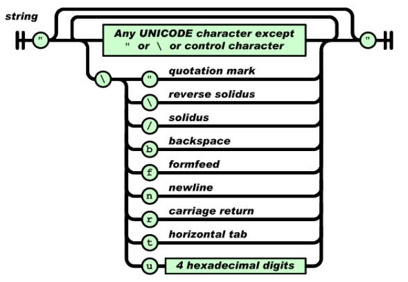

## Jackson

Jackson은 Java에서 Json 파일을 파싱할때 사용하는 라이브러리입니다.


### #API


### #예외처리

#### #원리

> JSON 문자열은 작은 따옴표로 인용 할 수 없습니다. 
> spec의 여러 버전 (Douglas Crockford의 원문, ECMA 버전 및 IETF 버전)은 모두 문자열을 큰 따옴표로 묶어야한다고 말합니다. 
> 이것은 이론적 인 문제도 아니고 의견의 문제도 아닙니다. 
> 작은 따옴표로 묶은 문자열을 구문 분석해야하는 경우 실세계의 모든 JSON 파서가 오류가 발생합니다.
>
> [참조] https://stackoverflow.com/questions/19176024/how-to-escape-special-characters-in-building-a-json-string




- [CASE1] 따라서 문자열 사이에 추가적인 큰 따옴표가 들어가면 파싱오류를 발생시킵니다.
  - 위의 인용구대로 JSON은 큰 따옴표로만 구성이 가능합니다.

- [CASE2] 사진의 경우를 제외한 `\`사용은 JSON encode 과정에서 파싱오류를 발생시킵니다.
  - JSON encode 하는 과정에서 `\`는 지원하지 않으나 위의 사진과 같이 몇몇 `\ + char`경우에는 허용하고 있습니다.


#### #해결

- [CASE1] JSON 이용과정에서 큰 따옴표가 넘어오는 경우는 흔하기 때문에 `" -> \"` 변환처리를 진행합니다.

- [CASE2] `\`를 수용할 수 없기 때문에 `http status 204`로 처리하여 반환합니다.

  - > The 204 status code means that the request was received and understood, but that there is no need to send any data back.

> Case1

```java
public static String parseDoubleQuotes(String target) {
    return target
        .replace("\"", "\\\"")
        .replaceAll("\\\\{1,}", "\\\\");
}
```

> Case2

```java

```

